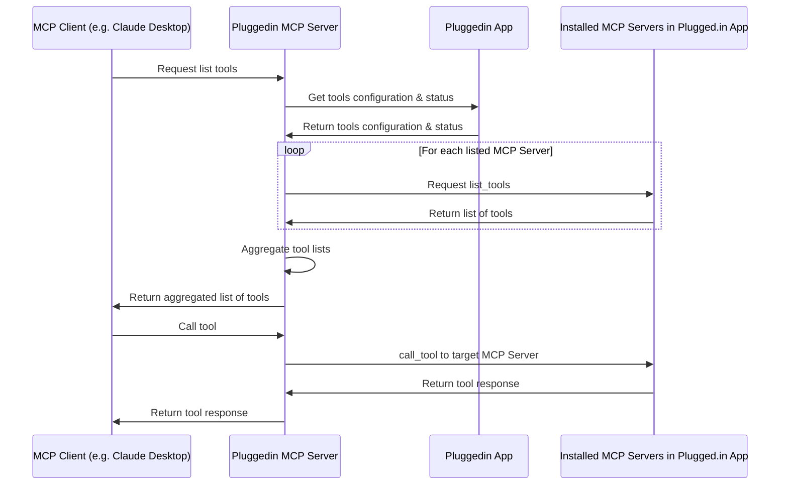

# Pluggedin MCP Server

[https://plugged.in](https://plugged.in): The One MCP to manage all your MCPs

Pluggedin MCP Server is a proxy server that joins multiple MCP⁠ servers into one. It fetches tool/prompt/resource configurations from Pluggedin App⁠ and routes tool/prompt/resource requests to the correct underlying server.

[](https://smithery.ai/server/@VeriTeknik/pluggedin-mcp-proxy)

<a href="https://glama.ai/mcp/servers/0po36lc7i6">
  
</a>

Pluggedin App repo: https://github.com/VeriTeknik/pluggedin-app

## Installation

### Installing via Smithery

Sometimes Smithery works (confirmed in Windsurf locally) but sometimes it is unstable because Pluggedin is special that it runs other MCPs on top of it. Please consider using manual installation if it doesn't work instead.

To install Pluggedin MCP Server for Claude Desktop automatically via [Smithery](https://smithery.ai/server/@VeriTeknik/pluggedin-mcp-proxy):

```bash
npx -y @smithery/cli install @VeriTeknik/pluggedin-mcp-proxy --client claude
```

### Manual Installation

```bash
export PLUGGEDIN_API_KEY=<env>
npx -y @pluggedin/pluggedin-mcp-proxy@latest
```

```json
{
  "mcpServers": {
    "Pluggedin": {
      "command": "npx",
      "args": ["-y", "@pluggedin/pluggedin-mcp-proxy@latest"],
      "env": {
        "PLUGGEDIN_API_KEY": "<your api key>"
      }
    }
  }
}
```

## Highlights

- Compatible with ANY MCP Client
- Multi-Workspaces layer enables you to switch to another set of MCP configs within one-click.
- GUI dynamic updates of MCP configs.
- Namespace isolation for joined MCPs.

## Environment Variables

- PLUGGEDIN_API_KEY: Required. Obtained from Pluggedin App's "API Keys" page (https://plugged.in/api-keys).
- PLUGGEDIN_API_BASE_URL: Optional override for Pluggedin App URL (e.g. http://localhost:12005).

## Command Line Arguments

You can configure the API key and base URL using command line arguments:

```bash
npx -y @pluggedin/pluggedin-mcp-proxy@latest --pluggedin-api-key <your-api-key> --pluggedin-api-base-url <base-url>
```

For help with all available options:

```bash
npx -y @pluggedin/pluggedin-mcp-proxy@latest --help
```

These command line arguments take precedence over environment variables.

## Architecture Overview



## Credits

- Inspirations and some code (refactored in this project) from https://github.com/adamwattis/mcp-proxy-server/